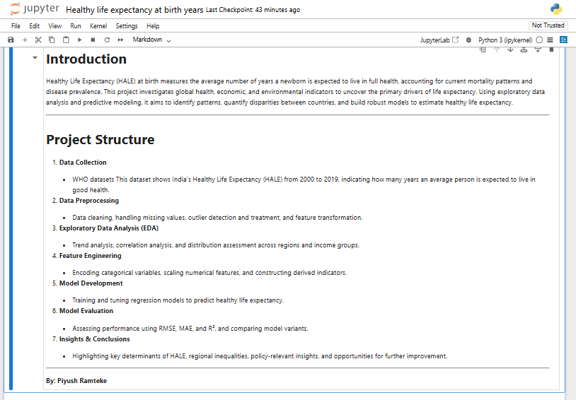
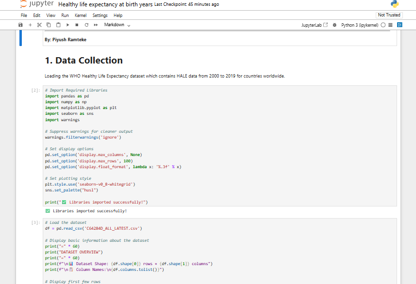
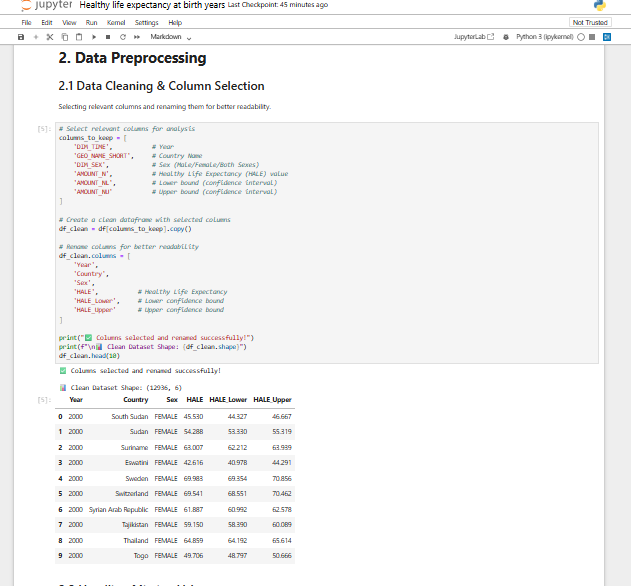
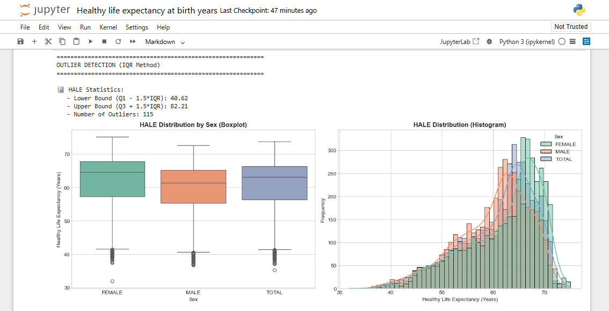
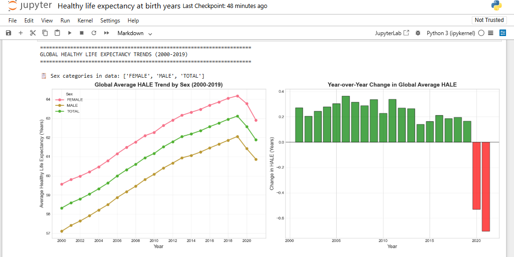
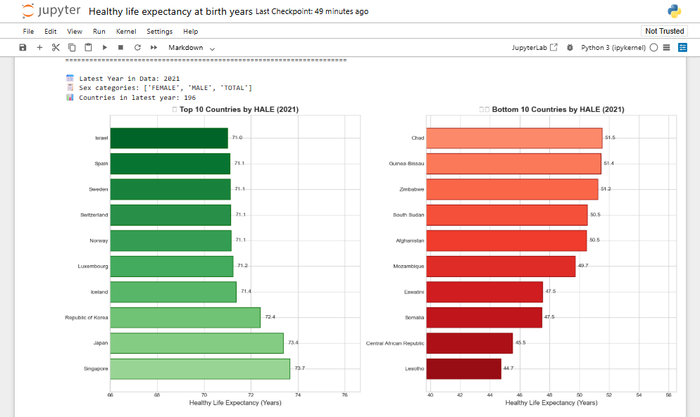
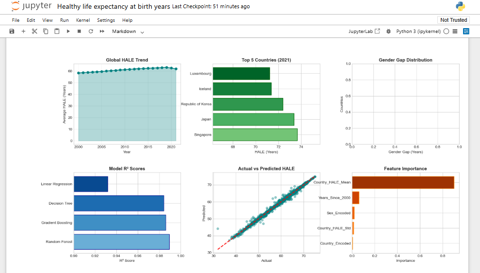
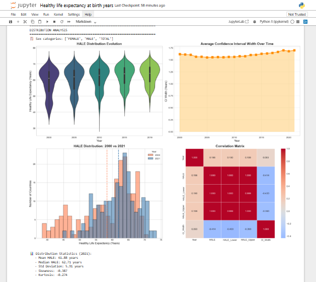

# Healthy Life Expectancy (HALE) Analysis

## 📋 Project Overview
This project analyzes and predicts Healthy Life Expectancy (HALE) using WHO datasets from 2000-2019. HALE represents the average number of years a person can expect to live in "full health" by considering both mortality and morbidity.

### 🎯 Project Goals
- Analyze factors influencing HALE across different countries
- Build predictive models for HALE
- Identify key health indicators affecting life expectancy
- Provide actionable insights for public health policy making

## 📊 Dataset Information
- **Source**: World Health Organization (WHO)
- **Time Period**: 2000 - 2019
- **Key Features**:
  - Demographic indicators
  - Healthcare access metrics
  - Disease prevalence rates
  - Economic indicators
  - Environmental factors
- **Target Variable**: Healthy Life Expectancy (HALE)

## 🏗️ Project Structure
```
project-root/
├── data/                    # Raw and processed data
├── notebooks/               # Jupyter notebooks for analysis
├── src/                     # Source code
│   ├── data_processing.py   # Data cleaning and preprocessing
│   ├── visualization.py     # Plotting functions
│   └── models.py            # Model implementations
├── results/                 # Saved models and outputs
├── README.md                # This file
└── requirements.txt         # Dependencies
```

## 🛠️ Technologies & Tools
- **Programming**: Python 3.8+
- **Data Processing**: Pandas, NumPy
- **Visualization**: Matplotlib, Seaborn
- **Machine Learning**: Scikit-learn
- **Development**: Jupyter Notebook, Git

## 🚀 Installation
1. Clone the repository:
   ```bash
   git clone [your-repo-url]
   cd [repo-name]
   ```
2. Create and activate a virtual environment:
   ```bash
   python -m venv venv
   source venv/bin/activate  # On Windows: venv\Scripts\activate
   ```
3. Install dependencies:
   ```bash
   pip install -r requirements.txt
   ```

## 📈 Results Summary
### Best Performing Model
- **Model**: [Model Name]
- **R² Score**: [Score]
- **MAE**: [Score] years

### 🌍 Global Trends

#### Global HALE Trend by Sex (2000–2019)


#### Year-over-Year Change in Global HALE


---

### 📉 Distribution & Outlier Analysis

#### HALE Distribution by Sex (Boxplot)


#### HALE Frequency Distribution (Histogram)


**Outlier Detection (IQR Method):**
- Lower Bound: 40.62  
- Upper Bound: 82.21  
- Outliers Detected: 115

---

### 🌐 Country-Level Comparisons

#### Top 10 vs Bottom 10 Countries by HALE (2021)


---

### 📈 Model Performance & Feature Importance

#### Model R² Scores Comparison


#### Actual vs Predicted HALE


#### Feature Importance (Random Forest)


---

### 📊 Statistical Evolution & Correlation

#### HALE Distribution Evolution (2000–2019)


#### Confidence Interval Width Over Time


#### HALE Distribution: 2000 vs 2021


#### Correlation Matrix


**Distribution Statistics (2021):**
- Mean HALE: 63.81 years  
- Median HALE: 65.71 years  
- Std Deviation: 8.52 years  
- Skewness: -0.297  
- Kurtosis: -0.274


## 📊 Visualizations
- HALE trends over time
- Feature importance analysis
- Geographic distribution of HALE
- Correlation heatmaps

## 🔮 Future Improvements
- [ ] Implement advanced ML models (XGBoost, Neural Networks)
- [ ] Create an interactive dashboard
- [ ] Include more recent data
- [ ] Add time-series forecasting

## 👨‍💻 Author
**Piyush Ramteke**  
[LinkedIn Profile]  
[Email]

## 📄 License
This project is licensed under the MIT License - see the [LICENSE](LICENSE) file for details.
